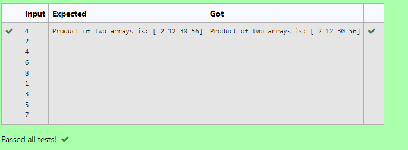

# Multiplying-two-matrix

## AIM:
To write a python program for multiplying two matrix.

## ALGORITHM:

### Step 1:
import numpy as np

### Step 2:
Give the inputs

### Step 3:
Use the for loop and range function

### Step 4:
Multiply the two matrices

### Step 5:
Check and verify the program

## PROGRAM: 
~~~

import numpy as np
l1,l2=[],[]
n=int(input())
for i in range(n):
    l1.append(int(input()))
for j in range(n):
    l2.append(int(input()))
array_1=np.array(l1)
array_2=np.array(l2)
product=array_1*array_2
print('Product of two arrays is:',product)

~~~

## OUTPUT:

## RESULT:
Thus the multiplying two matrix is sucessfully solved using python program

Sucessfully Finished 
